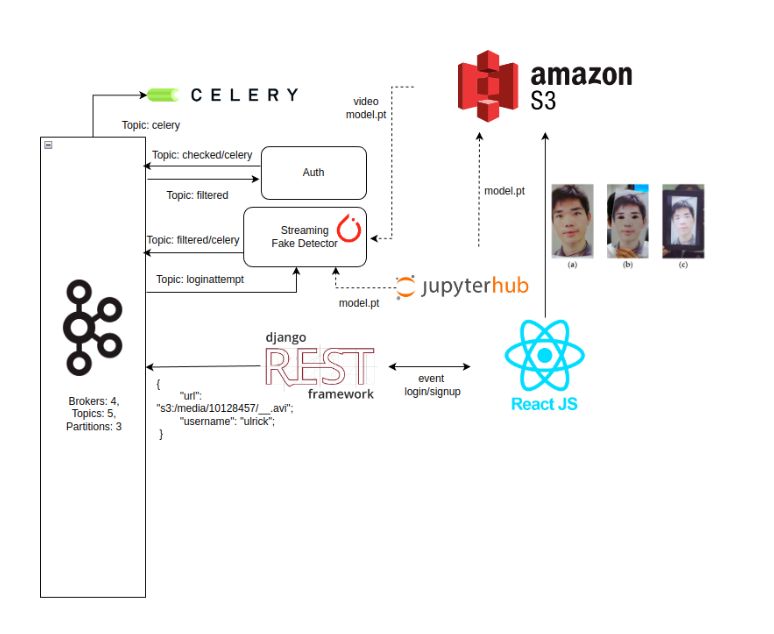

# Soft real time anti spoofing





[Dataset](https://www.dropbox.com/s/aaz282d9wyst0w8/CASIA_faceAntisp.rar
)


NOTA: si no tienes instalado nodemon ejecuta

```python
 npm i -g nodemon
```

---

## Paso 1: Levantar docker:kafka,kafaui,mongo,kafa-topic-init

```python
docker-compose up -d
```


---
## Paso 2:  levantar spoofing-kafka-server


### create env

```python
conda env create -f environment.yml
```

### activate env

```python
conda activate spoofing-kafka
```

### install dependencys

```python
make pip-tools
```

### ejecutar Auth

```python
cd kafka-sever/src && python Auth.py
```

### ejecutar FakeDetector

```python
cd kafka-sever/src && python Auth.py
```

---

## Paso 3: Levantar server

### instalar dependencias

```python
cd server && npm install

```

### levantar server

```python
cd server && nodemon index.js

```

---
## Paso 4 : Levantar front


### instalar dependencias

```python
cd client && npm install

```

### levantar server

```python
cd client && npm run dev
```
