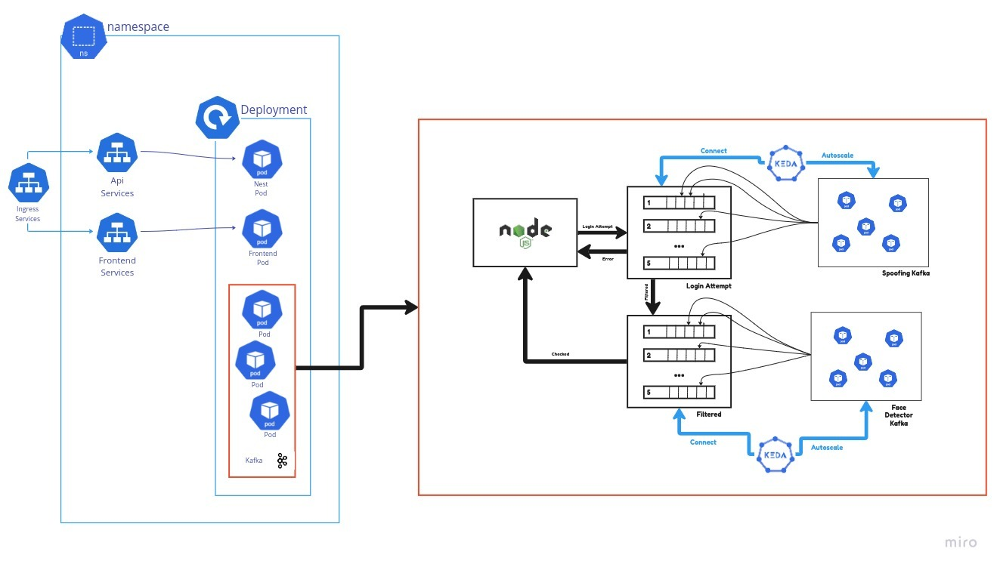

# Soft real time anti spoofing


## Diagrama 


## Arquitectura Kubernetes



[Dataset](https://www.dropbox.com/s/aaz282d9wyst0w8/CASIA_faceAntisp.rar

)


## Levantar Proyecto Docker

```python
docker-compose up -d --build
```


## Crear Cluster EKS
- export AWS_PROFILE=user1 # The name of the profile you want to use
- cd k8s/ && ./create-vpc-stack.sh
- cd k8s/ && ./create-eks-stack.sh


## Consideraciones de Instalacion previas

[KEDA](https://keda.sh/)

[Ingress-Nginx Controller](https://kubernetes.github.io/ingress-nginx/deploy/#quick-start)

[RedPanda](https://redpanda.com/)


## Levantar Eks o minikube

```python
make kub-create-all
```


